<div align="center">

<!-- PORTRAIT - generated by scripts/dotify.py from public/Images/Image.png -->
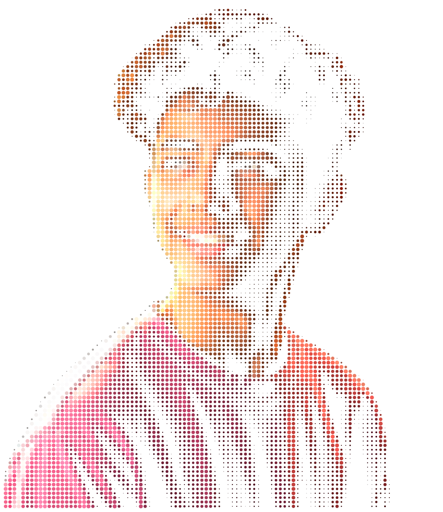

<br>

<!-- NAME / TAGLINE - animated typing -->
<a href="https://github.com/Mr-Anonymous-Guy">
  
</a>

<br>

<!-- SOCIALS -->
<a href="https://github.com/Mr-Anonymous-Guy"></a>
<a href="https://www.linkedin.com/in/mr-anonymous-guy/"></a>
<a href="mailto:mr.anonymous071105@gmail.com"></a>
<a href="https://x.com/anonymous_22181"></a>
<a href="https://anonymous2k26.vercel.app/"></a>
<a href="https://leetcode.com/u/Tutun_Mahapatra/"></a>


</div>

---

## `~/` whoami

```console
cat about.txt
```

Hi, I'm **Tutun Mahapatra** (also known as **Mr. Anonymous**). I build software across artificial intelligence, full-stack web platforms, and systems development, turning ideas into reality.

- Currently building **[Fhir-Tech](https://github.com/Mr-Anonymous-Guy/Fhir-Tech)** and exploring **[Healthcare_AI_Prototype](https://github.com/Mr-Anonymous-Guy/Healthcare_AI_Prototype)**
- Portfolio: **[anonymous2k26.vercel.app](https://anonymous2k26.vercel.app/)**
- Developing developer productivity tools like **[Nexterm](https://github.com/Mr-Anonymous-Guy/Nexterm)**
- Working with **Python**, **TypeScript**, **React**, **Next.js**, **C/C++**, and **Java**
- Philosophy: **Think. Build. Ship. Repeat.**
- Fun Fact: I am a night owl and a coffee lover.

<br>

<div align="center">

## `~/` toolbox


</div>

---

<div align="center">

## `~/` skill radar

<table>
<tr>
<td width="50%" align="center" valign="middle">

<!-- Self-rated radar - edit assets/skills.json, the workflow redraws it -->
<picture>
  <source media="(prefers-color-scheme: dark)"  srcset="assets/radar-dark.svg">
  <source media="(prefers-color-scheme: light)" srcset="assets/radar-light.svg">
  
</picture>

</td>
<td width="50%" align="center" valign="middle">

<!-- Live radar built from real language byte counts across your repos -->
<picture>
  <source media="(prefers-color-scheme: dark)"  srcset="assets/radar-langs-dark.svg">
  <source media="(prefers-color-scheme: light)" srcset="assets/radar-langs-light.svg">
  
</picture>

</td>
</tr>
</table>

</div>

---

<div align="center">

## `~/` contribution calendar

<!-- 3D isometric calendar, regenerated every 6h by .github/workflows/metrics.yml -->


<br><br>

<!-- Snake eats the contribution graph - .github/workflows/snake.yml -->
<picture>
  <source media="(prefers-color-scheme: dark)"  srcset="https://raw.githubusercontent.com/Mr-Anonymous-Guy/Mr-Anonymous-Guy/output/snake-dark.svg">
  <source media="(prefers-color-scheme: light)" srcset="https://raw.githubusercontent.com/Mr-Anonymous-Guy/Mr-Anonymous-Guy/output/snake.svg">
  
</picture>

</div>

---

<div align="center">

## `~/` the numbers

<!-- GitHub Statistics Card -->
<picture>
  <source media="(prefers-color-scheme: dark)"  srcset="assets/card-stats-dark.svg">
  <source media="(prefers-color-scheme: light)" srcset="assets/card-stats-light.svg">
  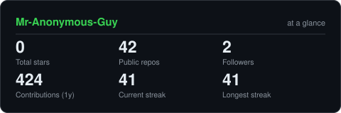
</picture>

<br><br>

<!-- Most Used Languages Card -->
<picture>
  <source media="(prefers-color-scheme: dark)"  srcset="assets/card-languages-dark.svg">
  <source media="(prefers-color-scheme: light)" srcset="assets/card-languages-light.svg">
  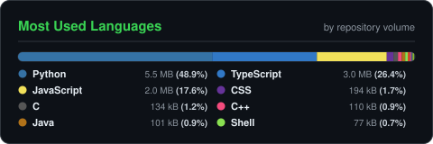
</picture>

<br><br>

<!-- Recent Coding Habits Card -->
<picture>
  <source media="(prefers-color-scheme: dark)"  srcset="assets/card-habits-dark.svg">
  <source media="(prefers-color-scheme: light)" srcset="assets/card-habits-light.svg">
  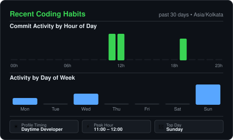
</picture>

<br><br>

<!-- Achievements Card -->
<picture>
  <source media="(prefers-color-scheme: dark)"  srcset="assets/card-achievements-dark.svg">
  <source media="(prefers-color-scheme: light)" srcset="assets/card-achievements-light.svg">
  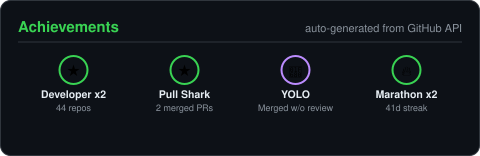
</picture>


</div>

---

<div align="center">

## `~/` selected work

<!-- Cards generated by scripts/cards.py from assets/projects.json -->
<table>
<tr>
<td width="50%">
  <a href="https://github.com/Mr-Anonymous-Guy/Fhir-Tech">
    <picture>
      <source media="(prefers-color-scheme: dark)"  srcset="assets/card-Fhir-Tech-dark.svg">
      <source media="(prefers-color-scheme: light)" srcset="assets/card-Fhir-Tech-light.svg">
      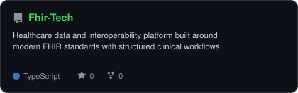
    </picture>
  </a>
</td>
<td width="50%">
  <a href="https://github.com/Mr-Anonymous-Guy/Healthcare_AI_Prototype">
    <picture>
      <source media="(prefers-color-scheme: dark)"  srcset="assets/card-Healthcare_AI_Prototype-dark.svg">
      <source media="(prefers-color-scheme: light)" srcset="assets/card-Healthcare_AI_Prototype-light.svg">
      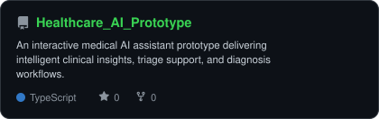
    </picture>
  </a>
</td>
</tr>
<tr>
<td width="50%">
  <a href="https://github.com/Mr-Anonymous-Guy/Nexterm">
    <picture>
      <source media="(prefers-color-scheme: dark)"  srcset="assets/card-Nexterm-dark.svg">
      <source media="(prefers-color-scheme: light)" srcset="assets/card-Nexterm-light.svg">
      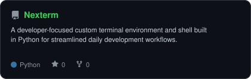
    </picture>
  </a>
</td>
<td width="50%">
  <a href="https://github.com/Mr-Anonymous-Guy/Wether">
    <picture>
      <source media="(prefers-color-scheme: dark)"  srcset="assets/card-Wether-dark.svg">
      <source media="(prefers-color-scheme: light)" srcset="assets/card-Wether-light.svg">
      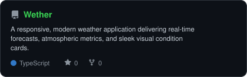
    </picture>
  </a>
</td>
</tr>
</table>

<sub>

| project | live | stack |
| --- | --- | --- |
| **[Fhir-Tech](https://github.com/Mr-Anonymous-Guy/Fhir-Tech)** | [fhir-tech.vercel.app](https://fhir-tech.vercel.app) | `TypeScript` `Next.js` `React` `Vercel` |
| **[Healthcare_AI_Prototype](https://github.com/Mr-Anonymous-Guy/Healthcare_AI_Prototype)** | [healthcare-ai-nu.vercel.app](https://healthcare-ai-nu.vercel.app) | `TypeScript` `React` `AI` |
| **[Nexterm](https://github.com/Mr-Anonymous-Guy/Nexterm)** | - | `Python` `CLI` `Shell` |
| **[Wether](https://github.com/Mr-Anonymous-Guy/Wether)** | [simplewether.vercel.app](https://simplewether.vercel.app) | `TypeScript` `React` `Vercel` |

</sub>

</div>

---

<div align="center">

<sub>`01110100 01101000 01100001 01101110 01101011 01110011 00100000 01100110 01101111 01110010 00100000 01110011 01100011 01110010 01101111 01101100 01101100 01101001 01101110 01100111`</sub>

</div>
